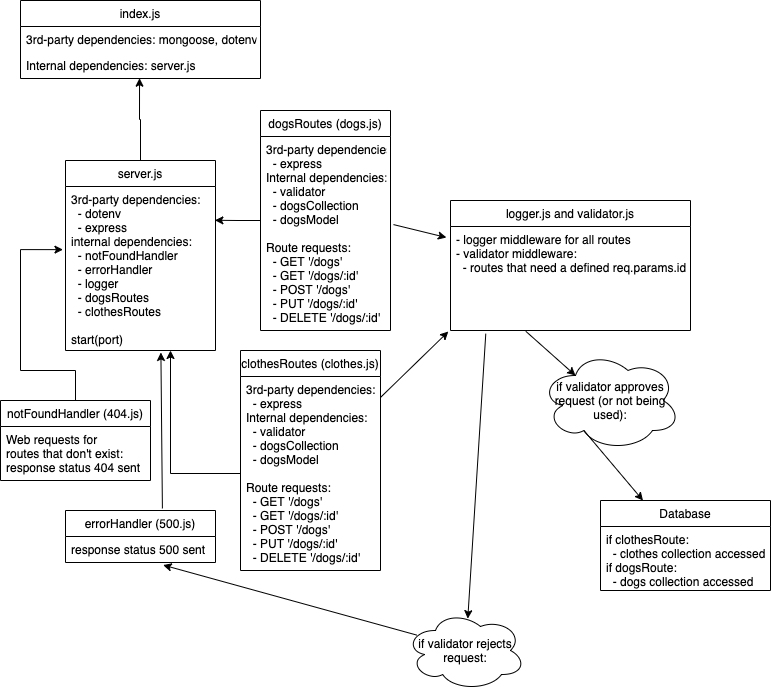

# Lab: Data Modeling

This is a simple back-end application that can perform CRUD operations on a MongoDB Database, using the REST standard.

## Author

Dar-Ci Calhoun

## Links

- [Pull request](https://github.com/dcalhoun286/api-server/pull/1)
- [Deployed site](https://dc-api-server.herokuapp.com)
- [GitHub Actions](https://github.com/dcalhoun286/api-server/actions)

## The Setup

### Github

1. Create a new repository at GitHub, called `api-server`
  1. Select the "Add a README" option
  1. Select the "Add a .gitignore" option, and choose Node.js
  1. Opt for the MIT license
1. Clone this repository to your local machine.
1. Create a "dev" branch to do your work in: `git checkout -b dev`

### Heroku

1. Login to your Heroku account
1. Create a new Heroku app, called `yourname-api-server`
  1. Go to the deployment tab
  1. Choose "GitHub"
  1. Connect to your repository
  1. Choose the "main" branch
  1. Choose the "Wait for CI to pass before deploy" option
  1. Choose the "enable automatic deploys" option
1. Configure a cloud database connection using the directions at [this link](https://developer.mongodb.com/how-to/use-atlas-on-heroku/)

### The Code

1. Initialize your app: `npm init -y`
1. Run `npm install`
1. Install your dpeendencies: `npm i dotenv express jest supertest`
1. Create the files and folders required for the application
1. Create the correct content in the files
1. Test your server: `npm test`
  1. You should see 100% of tests passing
1. Start your server: `nodemon`
  1. Visit [http://localhost:3000/](http://localhost:3000/) in your browser to confirm that the server is visible

## Deploy

Now that you have it all running, let's get it deployed.

### First: Deploy to Dev

1. Complete an **ACP** on your `dev` branch.
1. Go immediately to the repository on GitHub and open the actions tab
  1. You should see your tests running
  1. If they were passing on your local machine, they'll also pass here

### Second, go to production

Once your dev run has completed, you have successfully deployed your application through GitHub, with tests to an app on Heroku.

#### Now, we're going to complete the "real" deployment process

1. Open a pull request from `dev` to `main` on your GitHub repository
1. If your tests are passing, you will be able to merge this branch
1. Once you merge, the tets will run again using GitHub actions
1. Once the tests pass, Heroku will deploy your "main" branch to your app!
1. When that process completes, open your app in the browser to prove it.

## UML

## Resources and Documentation

- Tutor: Vinizio Sanchez
- Testing an Express middleware with jest: [Stack Overflow](https://stackoverflow.com/questions/60722281/testing-an-express-middleware-with-jest
- Setting up MongoDB for deployment on Heroku: [developer.mongodb.com](https://developer.mongodb.com/how-to/use-atlas-on-heroku/)
- Terminating mongoose connection when unit tests are complete: [Stack Overflow](https://stackoverflow.com/questions/50687592/jest-and-mongoose-jest-has-detected-opened-handles)
- Setting up unit tests with mongoose: [plainenglish.io](https://javascript.plainenglish.io/how-i-setup-unit-test-for-mongodb-using-jest-mongoose-103b772ee164)
